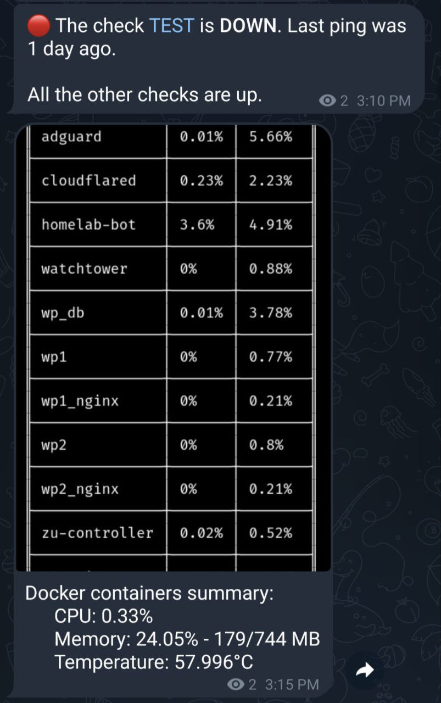

# Homelab utility service

The service is supposed to be run as a docker container which share the host socket so that it can easily monitor other running containers and do the reporting.

## Features

By reading containers info, the service can

* Send healthcheck signal via https://healthchecks.io/
* Send daily reports via a Telegram bot

    

## Setup

### Prepare environment variable

```
TELEGRAM_BOT_TOKEN=
TELEGRAM_CHANNEL_ID=

TARGET_DOCKER_HOST=
TARGET_DOCKER_PORT=

HEALTHCHECK_API_KEY=
```

### Prepare docker compose

```
version: '3.1'

services:
  homelab-bot:
    image: pvtri96/homelab-bot-service:latest
    restart: unless-stopped
    container_name: homelab-bot
    network_mode: host
    volumes:
      - ./healthcheck.config.json:/etc/homelab-bot/healthcheck.config.json
      - /var/run/docker.sock:/var/run/docker.sock
    environment:
      - TELEGRAM_BOT_TOKEN=$TELEGRAM_BOT_TOKEN
      - TELEGRAM_CHANNEL_ID=$TELEGRAM_CHANNEL_ID
      - HEALTHCHECK_CONFIG_PATH=/etc/homelab-bot/healthcheck.config.json
      - HEALTHCHECK_API_KEY=$HEALTHCHECK_API_KEY
      - DEBUG=1 # This will force running the cronjob right after service is initialized
```
